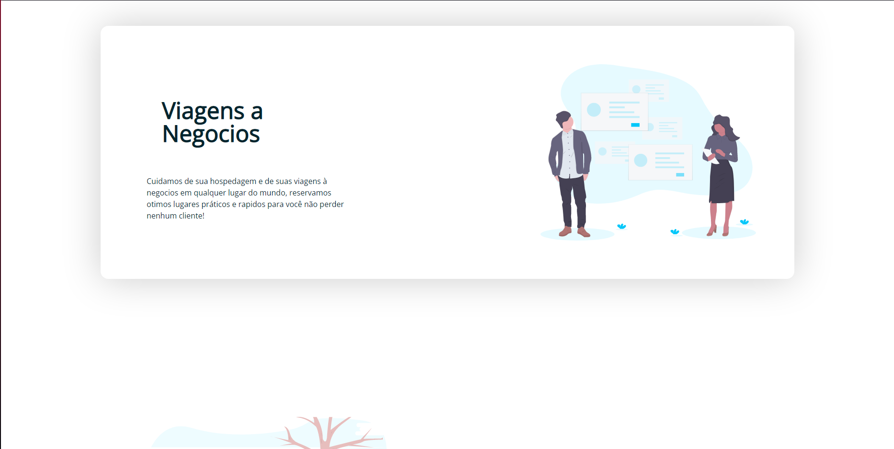
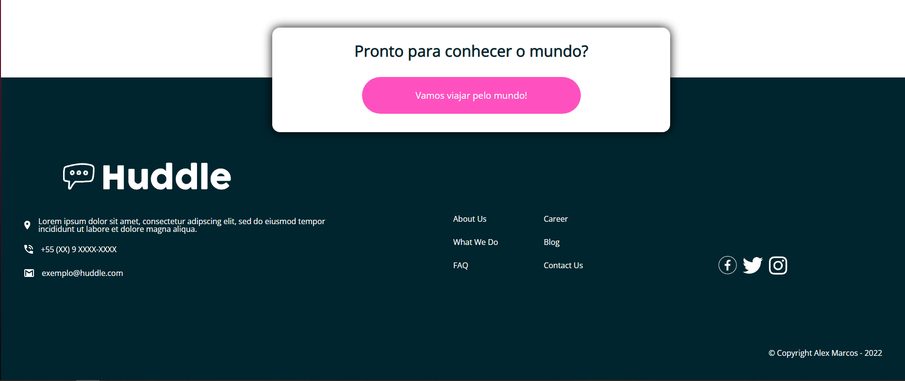
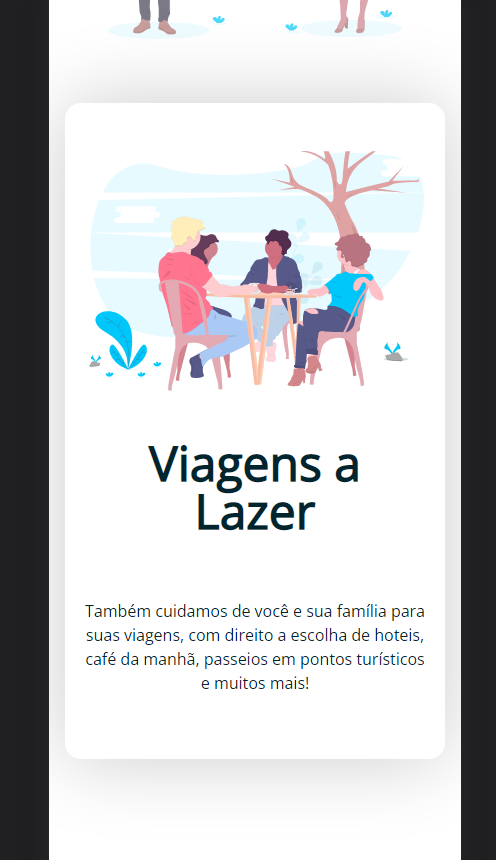

<h1 align="center">Viagens Company</h1>

Esse é um projeto que busquei no Frontend Mentor de nível Junior em HTML e CSS, o projeto foi iniciado na date de 24/07/2022 para ser entregue em 29/07/2022. 
Mudei a tematica do site de criação de companhias para uma companhia de viagens a fins diversos, algumas imagens são as mesmas fornecidas pelo site, entretanto a imagem 
do header não estava inclusa no meu download e tive que improvisar com outra.

Esse projeto tem como intuito o estudo das seguinte habilidades:

* - Responsividade com mobile
* - Reprodução de design
* - Produtividade e prazo de entrega
* - Aprendizado de display flex
* - Interatividade com os elementos ao passar o mouse em cima e ao clicar

<h2 align="center">Desafios propostos pelo site:</h2>

* - Seu desafio é criar a página com o design mais proximo o possível do design proposto.

* Você pode usar qualquer ferramenta que achar necessario.

## Os usuarios deverão ser capazes de:

- Visualizar o desplay do site de qualquer dispositivo independente do tamanho da tela.
- Interagir ao passar o mouse por cima dos elementos.

<h3 align="center">Imagens do resultado:</h3>

<h4 align="center">Técnologias usadas:</h4>

  
  
  

## Link para visualizar o projeto: 
https://laetuus.github.io/lanHouseWebsite/index.html

